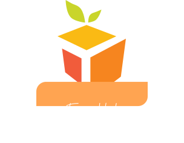

<h1 align="center">
    
</h1>

 • <a href="#-about">About</a> 
 • <a href="#-layout">Layout</a>  
 • <a href="#-tech-stack">Tech Stack</a>  

## 💻 About

Fruit Hub - Front-end challenge for Compass.Uol Scholarship Program.

---

## 🎨 Layout

  
  
  
  
  

---

## 🛠 Tech Stack

The following tools were used in the construction of the project:

-   **[HTML](https://developer.mozilla.org/en-US/docs/Web/HTML)**
-   **[SASS](https://sass-lang.com/)**
-   **[Javascript](https://developer.mozilla.org/en-US/docs/Web/JavaScript)**
